# Simulation & Verification Report

This document details the functional verification of each VHDL module through ModelSim/QuestaSim. Each simulation confirms that the hardware logic behaves as expected before deployment on the Altera Cyclone I.

---

## 1. BCD_Counter
**Objective:** Verify the basic 0-9 counting unit with enable and reset priority.

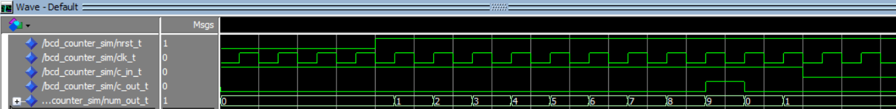

| Parameter | Value |
| :--- | :--- |
| Clock Frequency | 50 MHz |
| Simulation Length | 350 ns |

### Functional Checklist:
- [ ] **Reset Priority:** When `nrst` is active ('0'), the counter stays at 0 regardless of the `enable` signal.
- [ ] **Enable Control:** When `enable` is '0', the counter holds its current value.
- [ ] **Sequential Counting:** With `enable` at '1' and `nrst` at '1', the counter increments on each clock rising edge.
- [ ] **Overflow Handling:** When the counter reaches 9, it correctly wraps around to 0 on the next pulse.

---

## 2. X_Digits_BCD_Counter
**Objective:** Verify the communication and carry logic between multiple BCD stages.

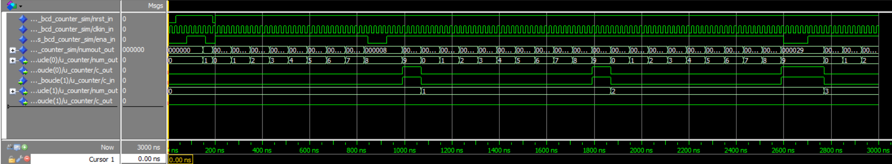

| Parameter | Value |
| :--- | :--- |
| Clock Frequency | 50 MHz |
| Simulation Length | 3 us |
| Reset Intervals | 0–35 ns; 190–200 ns |
| Enable Intervals | 80–160 ns; 200–845 ns; 945–2600 ns; 2700–3000 ns |

### Functional Checklist:
- [ ] **Multi-stage Reset:** All digits return to 0 when reset is triggered, even if the module is paused.
- [ ] **Inter-module Communication:**
    - **Interval 1:** Module pauses correctly while allowing reset operations.
    - **Interval 2 (Critical Value 8):** Confirms no bugs in carry logic when paused at a high value.
    - **Interval 3 (Critical Value 9):** Confirms that the carry-out to the next stage is generated correctly and doesn't trigger false counts when paused.
- [ ] **Cascading:** The second module increments exactly when the first one rolls over from 9 to 0.

---

## 3. Disp7Seg_Driver
**Objective:** Verify the combinational logic for hexadecimal to 7-segment decoding.

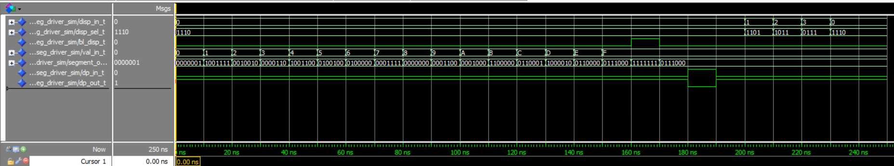

| Parameter | Value |
| :--- | :--- |
| Duration | 250 ns |
| Blanking Pulse | 160 – 170 ns |
| Dot Point Pulse | 180 – 190 ns |

### Functional Checklist:
- [ ] **Decoding Accuracy:** All hexadecimal inputs (0-F) correspond to the correct 7-segment segments.
- [ ] **Blanking Logic:** The `blank` input successfully clears all segments when active.
- [ ] **DP Logic:** The decimal point output correctly follows the negated logic of the input.

---

## 4. Disp7Seg_Controller
**Objective:** Verify the multiplexing logic and refresh rate for the 4-display interface.

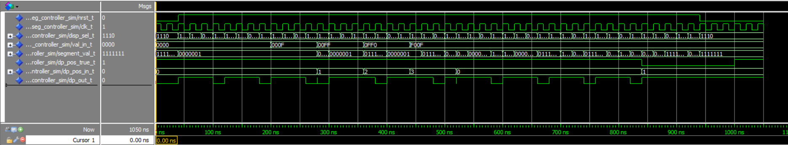

| Parameter | Value |
| :--- | :--- |
| Clock Frequency | 50 MHz |
| Duration | 1050 ns |

### Functional Checklist:
- [ ] **Multiplexing Order:** For a value like "3210", the controller correctly cycles through displays showing 0, 1, 2, then 3.
- [ ] **Refresh Rate:** The `display_select` signal rotates at the precisely configured frequency.
- [ ] **Dynamic DP:** The dot point moves correctly to the assigned display position and obeys the master enable.

---

## 5. Chronometer_Controller (Main Logic)
**Objective:** Verify the State Machine, Pause, and Flag (Lap time) functionality.

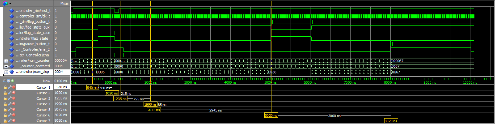
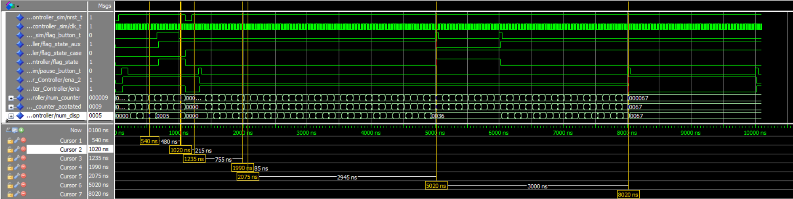
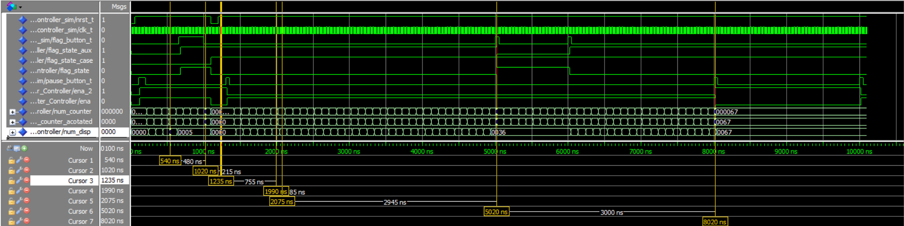
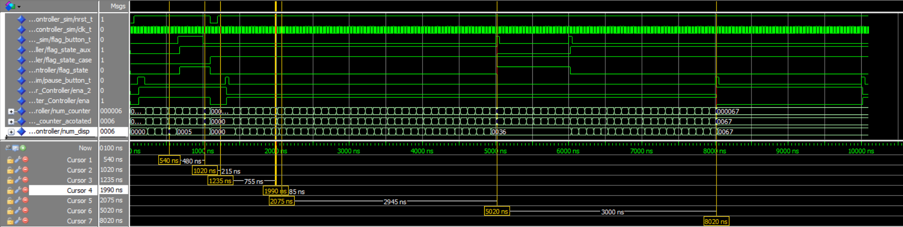
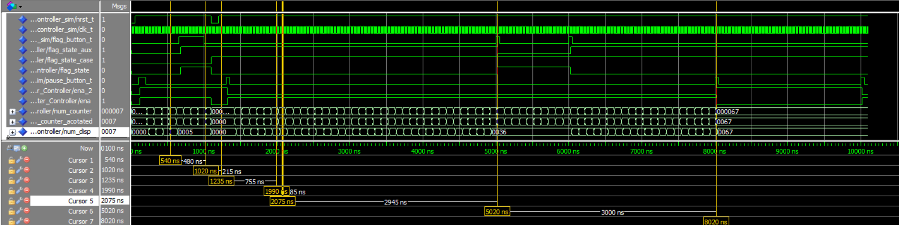
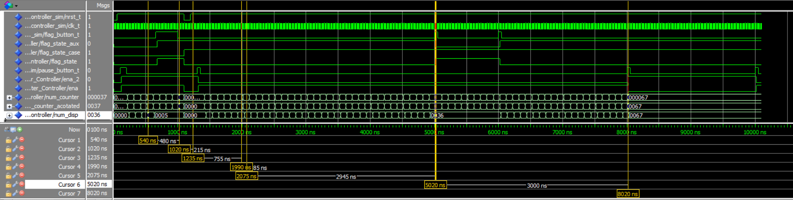
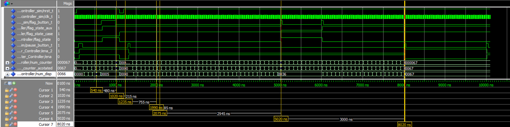

| Parameter | Value |
| :--- | :--- |
| Simulation Length | 10.1 us |
| Counting Frequency| 10 MHz |
| Refresh Rate | 12.5 MHz |

### Evidence Analysis:
- **Pause Mechanic (Cursor 7):** Confirms the pause button stops the time increment immediately.
- **Flag Mechanic (Cursor 6):** When Flag is active, the display freezes, but the internal "Background Counter" continues running.
- **Resync Logic (Cursors 4 & 5):** After deactivating Flag, the display "jumps" to match the background counter perfectly.
- **Background Integrity (Cursors 1 & 2):** Shows the counter and display are synchronized until the Flag state is entered.
- **Master Reset (Cursors 2 & 3):** `nrst` restarts the counter, pauses it, and forces the Flag state to inactive.

---

## 6. Chronometer_Controller (Decimal Point Mechanic)
**Objective:** Verify the "Auto-Range" logic where the decimal point appears after the first second.

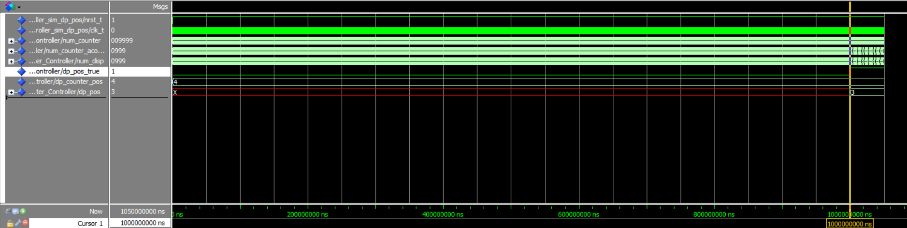

### Functional Checklist:
- [ ] **Enable Logic:** The DP remains disabled until the counter reaches its first second.
- [ ] **Position Mapping:** The internal position register maintains the value for the top-left display.
- [ ] **Logic Conversion:** Confirms the mapping between the 1-4 display count and the 0-3 unsigned logic required by the controller.
